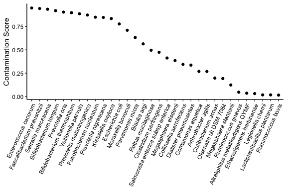

PRISM: PRecise Identification of Species of the Microbiome
================
Bassel Ghaddar
2024-09-04

## Introduction

<div style="float: right; text-align: center;">


<div style="text-align: center;">

<strong>Figure 1:</strong> Overview of PRISM.

</div>

</div>

PRISM identifies truly present microbial taxa in genomic sequencing data
and eliminates falsely positive artifacts and contaminants. It
identifies uniquely identifiable taxa using full-length mapping of a
representative subsample of sequencing reads and taxa first identified
with fast, k-mer-based taxonomic classification. It then employs a
machine learning model to predict tissue-present microbes
vs. contaminants based on multiple features engineered from read mapping
and gene expression statistics (Fig. 1). PRISM works on any genomic
sequencing type (e.g. RNA, DNA, 16S, scRNA-seq, etc.).

Please see the reference below for more information.

Please contact Bassel Ghaddar (<bassel.ghaddar@gmail.com>) for any
questions.

## Running PRISM

PRISM requires the following dependencies:

1.  Kraken2: <https://github.com/DerrickWood/kraken2>
2.  Seqkit: <https://bioinf.shenwei.me/seqkit/>
3.  STAR: <https://github.com/alexdobin/STAR>
4.  BLAST:
    <https://ftp.ncbi.nlm.nih.gov/blast/executables/blast+/LATEST/>
5.  R packages: optparse, ShortRead, tidyverse, furrr, data.table, vegan

PRISM is a single command-line R function `PRISM.R`:

### Input

`PRISM.R`

- `--sample` sample name (excluding file extension; e.g. the sample name
  for ABC_1.fastq is “ABC”)
- `--data_path` path to fastq file(s)
- `--kraken_path` path to Kraken2 executable
- `--kraken_db_path` path to Kraken2 reference database
- `--seqkit_path` path to SeqKit
- `--star_path` path to STAR
- `--star_genome_dir` path to STAR human genome index (for –genomeDir
  parameter)
- `--blast_path` path to blastn
- `--blast_db_path` path to BLAST reference database
- `--prism_path` path to PRISM repository
- `--paired` whether fastq files are paired (T) or unpaired (F); default
  is (T)
- `--fq1_end` ending of fastq file 1 (e.g. for ABC_1.fastq it would be
  “\_1.fastq”)
- `--fq2_end` ending of fastq file 2 (if applicable; e.g. for ABC.fa2 it
  would be “.fa2”)
- `--barcode_only` whether fastq file 1 contains only a single-cell
  barcode (T) or a sequence (F); Default = F
- `--max_sample` maximum number of reads per taxon to sample for the
  initial BLAST step; Default = 1000
- `--min_read_per` minimum reads for a taxon per X to analyze. Default
  is 1 per 10,000 (min_read_per=10^4)
- `--min_uniq_frac` minimum ratio of number ofunique k-mers to Kraken
  reads for a taxon. Default = 5
- `model_org_taxids` path to .txt file with model organism taxids;
  default file includes Mus and Rodentia species

### Output

PRISM creates a directory for sample `X` called `~/X_prism` and outputs
3 key files: `X-results.csv`, `X-counts.csv`, and `X.fa`, described
below.

`X-results.csv`: This is the final BLAST result after determining the
uniquely identifiable species and removing human, model organism, and
vector sequences and resolving multi-mapping reads. It also contains the
PRISM contamination score for each taxon. Each row corresponds to a
sequencing read, with the columns as follows:

- `id` Sequence ID
- `staxids` NCBI taxon ID assigned
- `rank` Highest resolution phylogenetic rank (k,p,c,o,f,g,s) for read
- `tax_name` Taxon scientific name
- `read` Whether assignment is from read 1 or 2 (for paired reads)
- `pos` BLAST accession mapping position
- `ppos` BLAST percentage of positive scoring matches
- `bitscore` BLAST Bit score
- `strand` BLAST subject strand
- `qcovs` BLAST query coverage per subject
- `sacc` BLAST subject accession
- `definition` BLAST accession name
- `version` BLAST accession version
- `gene` Genbank gene of mapped sequence
- `start` Mapping start position
- `end` Mapping end position
- `product` Genbank product of mapped sequence
- `protein` Mapped protein ID
- `cog` NCBI Database of Clusters of Orthologous Genes (COG)
- `cat` NCBI COG category
- `pred` PRISM contamination score (0=contaminant, 1=truly present)

`X-counts.csv`: This file gives a summary of the counts of each species
and their contamination scores, as well as counts of all phylogenetic
levels. This is only intended as an initial summary, as the counts will
change if the user filters the `X-results.csv` file by the contamination
score and/or read query coverage (see example analysis below). The
columns in this file are:

- `name` Taxon name
- `taxid` NCBI taxon ID
- `rank` Taxon rank
- `n` Taxon read counts
- `pred` Taxon contamination score (only for species; 0=contaminant,
  1=truly present)

`X_1.fa/X_2.fa`: PRISM outputs fasta files of the identified microbial
reads.

`~/X_prism/data` contains all intermediate files produced by PRISM,
including files from Kraken2 and STAR

## Example on 16S metagenomics data from pancreatic cancer

We use PRISM to analyze pancreatic tumor sample D18 from Ghaddar et al,
Cancer Cell 2022. A subsampled fasta file `D18.fa` is included in this
repository.

``` bash
Rscript \
/path/to/PRISM/PRISM.R \
--sample D18 \
--data_path /path/to/fasta/ \
--kraken_path /path/to/kraken2-master/kraken2 \
--kraken_db_path /path/to/kraken_db \
--seqkit_path /path/to/seqkit \
--star_path /path/to/STAR-2.7.11b/bin/Linux_x86_64_static/STAR \
--star_genome_dir /path/to/star_index \
--model_org_taxids /path/to/PRISM/model_org_taxids.txt \
--blast_path  /path/to/blast/2.16/bin/blastn \
--blast_db_path /path/to/BLAST/NT_db/ \
--prism_path /path/to/PRISM/ \
--fq1_end .fa \
--paired F
```

The file `D18-results.csv` can be used to so select a contamination
score cutoff:

``` r
library(tidyverse)

res = read.csv('D18-results.csv') 
head(res)
```

    ##                                        id staxids rank                tax_name
    ## 1 A01415:265:HMMMFDRXY:1:2101:10276:13213     571    s      Klebsiella oxytoca
    ## 2 A01415:265:HMMMFDRXY:1:2101:12671:25911     562    s        Escherichia coli
    ## 3 A01415:265:HMMMFDRXY:1:2101:13141:11224   39950    s  Dialister pneumosintes
    ## 4  A01415:265:HMMMFDRXY:1:2101:13792:3270   74426    s Collinsella aerofaciens
    ## 5   A01415:265:HMMMFDRXY:1:2101:1398:6386     615    s     Serratia marcescens
    ## 6 A01415:265:HMMMFDRXY:1:2101:14995:16157   33033    s        Parvimonas micra
    ##   read pos    ppos bitscore strand qcovs     sacc
    ## 1    1 329 100.000      420   plus   100 AJ871858
    ## 2    1 317 100.000      420   plus   100         
    ## 3    1 374  99.559      414   plus   100 HM596297
    ## 4    1 320  94.787      329   plus    93 AJ245920
    ## 5    1 313 100.000      420   plus   100 AJ296308
    ## 6    1 344  99.559      414   plus   100 AM176533
    ##                                                           definition    version
    ## 1        Klebsiella oxytoca partial 16S rRNA gene type strain SB175T AJ871858.1
    ## 2                                                                              
    ## 3 Dialister pneumosintes strain F0409 16S ribosomal RNA gene partial HM596297.1
    ## 4          Collinsella aerofaciens partial 16S rRNA gene strain H818 AJ245920.1
    ## 5                  Serratia marcescens 16S rRNA gene isolate CPO14CU AJ296308.1
    ## 6            Micromonas micros partial 16S rRNA gene isolate gpac135 AM176533.1
    ##       gene start  end           product protein cog cat      pred
    ## 1 16S rRNA     1 1454 16S ribosomal RNA          NA  NA 0.8349080
    ## 2             NA   NA                            NA  NA 0.7773360
    ## 3              1 1547 16S ribosomal RNA          NA  NA 0.3365791
    ## 4 16S rRNA     1 1417 16S ribosomal RNA          NA  NA 0.3443068
    ## 5 16S rRNA     1 1408 16S ribosomal RNA          NA  NA 0.9350958
    ## 6 16S rRNA     1 1447 16S ribosomal RNA          NA  NA 0.6324008

``` r
ggplot(res %>% subset(rank == 's') %>% distinct(tax_name, pred), aes(x=reorder(tax_name, -pred),y=pred)) + 
  geom_point() + 
  theme_classic() + 
  ylab('Contamination Score') + 
  theme(axis.text.x = element_text(angle = 65, hjust=1),
        axis.text = element_text(color = 'black'), 
        axis.title.x = element_blank())
```



Users may wish to filter taxa for a minimum read count, query coverage
percentage (qcovs), and contamination score (pred). Here is one way to
filter for species with \>100 reads, contamination score \> 0.2, and
reads with qcovs \> 0.8:

``` r
res %>% 
  subset(rank == 's' & qcovs > 0.8 & pred > 0.2) %>% 
  group_by(tax_name, staxids, pred) %>% 
  summarize(n = n(), .groups = 'drop') %>%
  subset(n > 100) 
```

    ## # A tibble: 11 × 4
    ##    tax_name                     staxids  pred     n
    ##    <chr>                          <int> <dbl> <int>
    ##  1 Bifidobacterium longum        216816 0.920   106
    ##  2 Collinsella aerofaciens        74426 0.344   241
    ##  3 Dialister pneumosintes         39950 0.337   619
    ##  4 Escherichia coli                 562 0.777  1112
    ##  5 Faecalibacterium prausnitzii     853 0.943   135
    ##  6 Fusobacterium nucleatum          851 0.850  1189
    ##  7 Klebsiella oxytoca               571 0.835   877
    ##  8 Parvimonas micra               33033 0.632   442
    ##  9 Prevotella melaninogenica      28132 0.873   190
    ## 10 Prevotella oris                28135 0.905   981
    ## 11 Serratia marcescens              615 0.935   647

Users can also examine the microbial genes and products mapped and their
corresponding NCBI gene ortholog categories. The example data is from
16S gene sequencing, and that is what PRISM finds:

``` r
table(subset(res, product != '')$product) %>% sort() 
```

    ## 
    ## FadR family transcriptional regulator GntR family transcriptional regulator 
    ##                                     1                                     1 
    ##                              tRNA-Ser                       MFS transporter 
    ##                                     2                                    10 
    ##                     16S ribosomal RNA 
    ##                                  7688

PRISM also outputs a FASTA file annotated microbial reads annotated with
PRISM’s identified taxid, BLAST mapping accession (sacc) and mapping
position (pos). This can be useful for verifying read alignments or
identifying barcodes and UMIs in single cell data.

``` bash
head -n 12 D18_1.fa
```

    ## >A01415:265:HMMMFDRXY:1:2134:22363:20055 1:N:0:TCAGCCTT+CTGTATGC | PRISM | staxids:851 sacc:AJ810276 pos:349
    ## TGGGGAATATTGGACAATGGACCAAGAGTCTGATCCAGCAATTCTGTGTGCACGATGAAGTTTTTCGGAATGTAAAGTGC
    ## TTTCAGTTGGGAAGAAAGAAATGACGGTACCAACAGAAGAAGTGACGGCTAAATACGTGCCAGCAGCCGCGGTAATACGT
    ## ATGTCACGAGCGTTATCCGGATTTATTGGGCGTAAAGCGCGTCTAGGTGGTTATATAAGTATGATGT
    ## >A01415:265:HMMMFDRXY:1:2127:16767:5384 1:N:0:TCAGCCTT+CTGTATGC | PRISM | staxids:851 sacc:AJ810275 pos:349
    ## TGGGGAATATTGGACAATGGACCAAGAGTCTGATCCAGCAATTCTGTGTGCACGATGAAGTTTTTCGGAATGTAAAGTGC
    ## TTTCAGTTGGGAAGAAATAAATGACGGTACCAACAGAAGAAGTGACGGCTAAATACGTGCCAGCAGCCGCGGTAATACGT
    ## ATGTCACGAGCGTTATCCGGATTTATTGGGCGTAAAGCGCGTCTAGGTGGTTATGTAAGTCTGATGT
    ## >A01415:265:HMMMFDRXY:1:2267:9462:15092 1:N:0:TCAGCCTT+CTGTATGC | PRISM | staxids:28135 sacc:JN867292 pos:347
    ## TGAGGAATATTGGTCAATGGGCGAGAGCCTGAACCAGCCAAGTAGCGTGCAGGAAGACGGCCCTATGGGTTGTAAACTGC
    ## TTTTATGCGGGGATAAAGTGAGGGACGTGTCCTTCATTGCAGGTACCGCATGAATAAGGACCGGCTAATTCCGTGCCAGC
    ## AGCCGCGGTAATACGGAAGGTCCTGGCGTTATCCGGATTTATTGGGTTTAAAGGGAGCGTAGGCCGT

## Reference

Coming soon.
